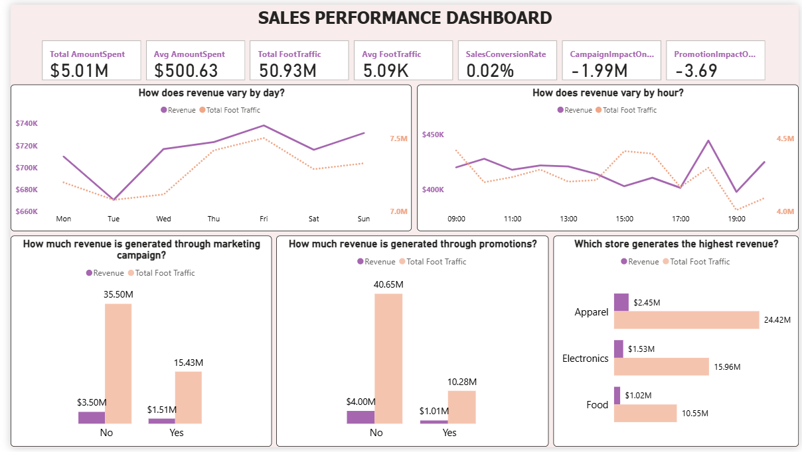
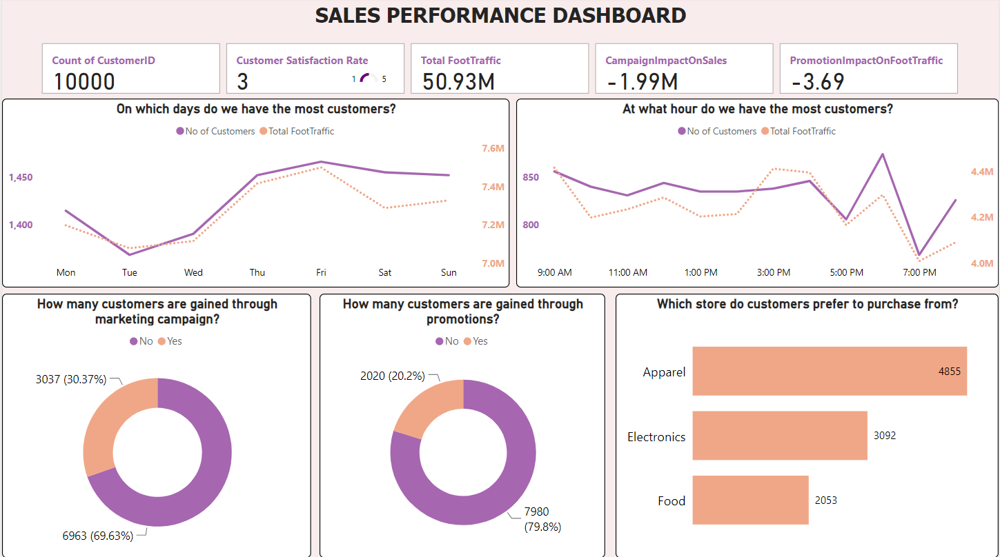

# 🛍️ **MallTrendX: Sales & Customer Insight Dashboard**

## 📌 Project Overview

**MallTrendX** is a Power BI dashboard that analyzes sales trends and customer behavior at **Fashion Forward Mall**. The mall has been experiencing irregular foot traffic and inconsistent sales across its stores. This project helps identify the root causes and provides actionable insights to optimize operations and boost performance.

> 🎯 **Goal**: Deliver data-driven insights to enhance customer experience and maximize store-level performance.

---

## 🚨 Problem Statement

Fashion Forward Mall is facing:

* Fluctuating **foot traffic**
* Inconsistent **sales trends**
* Ineffective **marketing campaigns and promotions**

To tackle these challenges, the MallTrendX dashboard was created to visualize and interpret critical retail KPIs using data analytics.

---

## 🎯 Objectives

1. ⏰ **Identify peak shopping hours and days**
2. 🛍️ **Discover customer preferences by store type**
3. 📢 **Evaluate marketing and promotion effectiveness**
4. 💡 **Provide actionable insights for strategic decision-making**

---

## ❓ Research Questions

* What are the **peak shopping hours and days** at the mall?
* Which **store types** attract the most customers and generate the most revenue?
* How do **campaigns and promotions** influence foot traffic and sales?
* What causes the **fluctuations in customer behavior**?

---

## 🧰 Tech Stack

| Tool         | Role                                      |
| ------------ | ----------------------------------------- |
| **Power BI** | Dashboard creation and data visualization |
| Excel/CSV    | Raw dataset for analysis                  |
| DAX          | KPIs and calculated metrics               |

---

## 📊 Dashboard Features

The **MallTrendX Dashboard** includes:

* Foot traffic heatmaps by day and hour
* Revenue vs Customer trendlines
* Store type performance (Apparel, Electronics, Food, etc.)
* Campaign & promotion effectiveness charts
* Filters: date range, store category, campaign type

> 🧠 Designed to be interactive, insightful, and ready for executive decision-making.

---

## 🔍 Key Insights

### 📈 Correlation Insights

* **Revenue ↔️ Customers/hour**: Strong positive correlation (**0.75**)
* **Foot traffic ↔️ Customers/hour**: Strong positive correlation (**0.75**)
* **Foot traffic ↔️ Revenue/hour**: Weak correlation (**0.16**)

### 🏬 Store Performance

* **Apparel** stores lead in traffic and revenue.
* **Electronics** stores rank second in both footfall and performance.

### 📣 Campaign & Promotion Effectiveness

* **\~70%** of foot traffic and purchases occurred **without marketing campaigns**
* **\~80%** of purchases and revenue happened **without promotions**

This suggests that **current campaigns and offers are underperforming**.

---

## ✅ Recommendations

* 🔁 **Revise marketing strategies**: Experiment with targeted, data-driven campaigns.
* ⏰ **Optimize staffing & inventory for peak hours**: e.g., **6 PM and Fridays**
* 📉 **Boost engagement on low-performing days**: e.g., **Tuesday**
* 📌 **Replicate success of apparel stores**: Apply their best practices to underperforming segments.

---

### 🧬 GitHub Repository & Clone Instructions

🔗 **GitHub Repo**: [https://github.com/yourusername/MallTrendX-Dashboard](https://github.com/yourusername/MallTrendX-Dashboard)

To **clone the project locally using Git**:

1. Make sure Git is installed on your system.
2. Open your terminal (CMD, Git Bash, or VS Code terminal).
3. Run the following command:

```bash
git clone https://github.com/yourusername/MallTrendX-Dashboard.git
```

4. Navigate into the cloned folder:

```bash
cd MallTrendX-Dashboard
```

5. Open the `.pbix` file in **Power BI Desktop** to explore the dashboard.
6. Review the dataset (`mall_dataset.csv`) and feel free to connect it or replace it with your own.

---


---

## 📎 Dashboard Preview (Insert Screenshot)



---

## 📬 Contact

**Vinayak Vathare**
📧 Email: [work.vinayakvathare@gmail.com](mailto:work.vinayakvathare@gmail.com)  
🔗 LinkedIn: [linkedin.com/in/vinayakvathare](https://www.linkedin.com/in/vinayakvathare/)  
💻 GitHub: [github.com/VathareVinayak](https://github.com/VathareVinayak)

---

Let me know if you want this turned into a **1-page PDF**, **portfolio slide**, or **LinkedIn project description** — I’ll help with that too!
